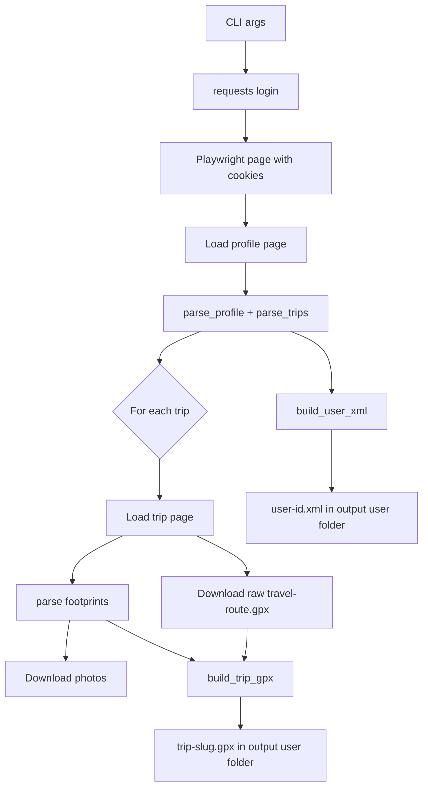

# FindPenguinsScrapper Architecture

This document describes the high-level architecture of the FindPenguinsScrapper project and how data flows from FindPenguins pages to local XML and GPX outputs.

## Goals

- Authenticate on findpenguins.com.
- Scrape profile, trips, and footprint details.
- Download trip route GPX and photos.
- Produce:
  - one profile XML index per user
  - one enriched GPX file per trip

## Main Components

- `findpenguins_scrapper.py`
  - CLI entrypoint and workflow orchestrator.
  - Coordinates login, page loading, parsing, and writing.

- `fp_config.py`
  - Central constants for URLs, headers, and XML namespaces.

- `fp_utils.py`
  - Shared utility layer:
  - HTTP + browser setup (requests + Playwright)
  - login helpers
  - dynamic page loading
  - text normalization
  - image download
  - XML formatting helpers

- `fp_parsers.py`
  - HTML/UI extraction layer.
  - Parses profile-level metadata.
  - Parses trip list and companions.
  - Parses trip footprints and popup metadata.

- `fp_writers.py`
  - Serialization layer.
  - Builds profile XML index.
  - Builds trip GPX metadata + waypoints and preserves track segments.

- `elevation.py`
  - Optional elevation enrichment for route track points (`trkpt`).
  - Uses OpenTopoData or Open-Meteo/Copernicus endpoints.

## Runtime Architecture

## Output Layout

For user id `<uid>`, output is written under `output/<uid>/`.

Typical structure:

- `output/<uid>/<uid>.xml`
- `output/<uid>/<trip-slug>.gpx`
- `output/<uid>/<trip-slug>/` (photos, optional saved HTML, downloaded original route GPX before merge)

## Design Decisions

- Split responsibilities: parser module only extracts data, writer module only serializes.
- Keep route fidelity: if a route GPX is downloadable, its `trk`/`trkpt` track stays the source of route truth.
- Add narrative data as waypoints: each footprint becomes a `wpt` with rich extensions.
- Keep user index lightweight: XML references each trip GPX by relative path.
- Tolerate partial failures: trip-level exceptions do not stop processing of remaining trips.

## Error Handling Model

- Network and parsing operations are wrapped to avoid full-run crashes.
- Missing popup fields, photos, or elevation values are tolerated.
- When a trip fails, it is still represented in user XML with an expected GPX path.

## Extensibility Points

- Add new extracted footprint fields in `fp_parsers.py`.
- Map those fields to GPX extensions in `fp_writers.py`.
- Add additional export formats alongside existing XML/GPX outputs.
- Add schema validation steps as a post-processing stage.
